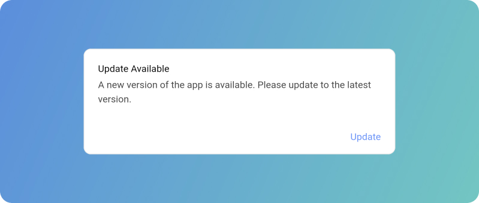
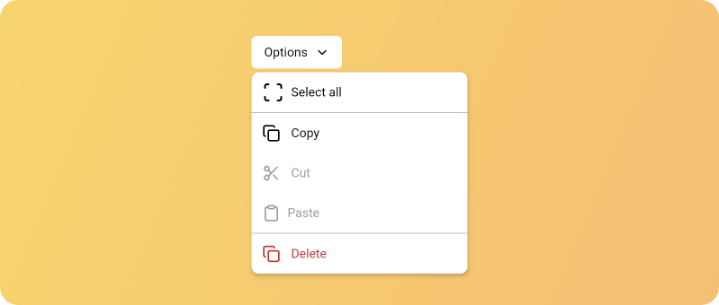

--- 
hide: -navigation -toc 
---

# Composables Core

Unstyled, fully accessible Compose Multiplatform UI components that you can customize to your heart's desire.

Available for Compose Desktop, Compose Web (Js/WASM), Jetpack Compose (Android), iOS, and any other platform Compose can run on.

  

    
    
Dialog

  

  

    
    
Dropdown Menu

  

