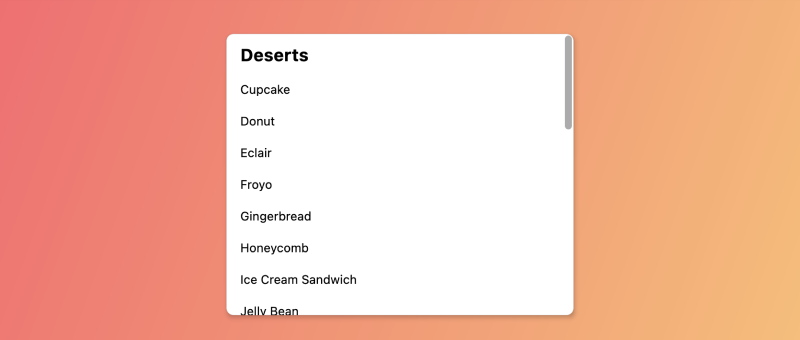
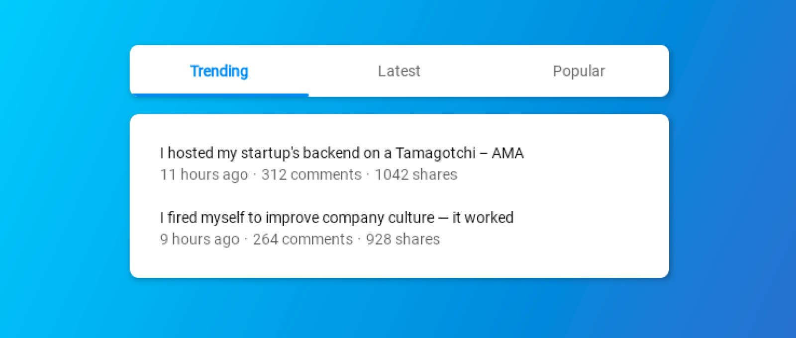

--- 
hide: -navigation -toc 
---

# Compose Unstyled

Unstyled, fully accessible components for Jetpack Compose & Compose Multiplatform that you can customize to your heart's content.

Available for 🖥️ Desktop, 🌐 Web (Js/WASM), 🤖 Android, 🍎 iOS, and any other platform Compose can run on.

    

        
        
Bottom Sheet

    

    

        
        
Bottom Sheet (Modal)

    

  

    
    
Dialog

  

  

    
    
Dropdown Menu

  

  

    
    
Icon

  

  

      
      
Scroll Area

  

  

      
      
Separators

  

  

      
      
Slider

  

    

        
        
Tab Group

    

## What developers say

  

    
  

  

    

      "@alexstyl just wanted to let you know that we just transition from M3 Modal Bottom Sheet to your Compose Unstyled one and <a class="highlight" href="/modal-bottom-sheet">it fixed multiple issues 🎉</a>"
    

    

      
Matt Kula

      
Android Engineer, Warner Music Group

    

  

  

    
  

  

    

"Ever since Compose Unstyled was pointed out to me I use that one.
<a class="highlight" href="/modal-bottom-sheet">Simpler API, and it actually works.</a> I like it a lot, after continuously having something broken with the (Material Compose) bottom sheets."  
    

    

      
Jacob Ras

      
Android Engineer, Albert Heijn

    

  

  

    
  

  

    

      "Thank you for making <a class="highlight" href="/modal-bottom-sheet">the only bottomsheet</a> composable library <a class="highlight" href="/modal-bottom-sheet">that actually makes sense!</a>"
    

    

      
Isaac Zikstar

      
Android Engineer, Block

    

  

  

    
  

  

    

"This man did, what Googlers couldn't in 3 years of <a class="highlight" href="/scrollarea">scrollbars</a> "being on the roadmap" #androiddev"  
    

    

      
Gabor Varadi

      
EpicPandaForce

    

  

  

    
  

  

    

      "I wrote this library, so this will be biased 😁. I was tired of dealing with Material Compose sheets and dialogs issues, <a class="highlight" href="/bottom-sheet">so I decided</a> <a class="highlight" href="/modal-bottom-sheet">to write my own</a> <a class="highlight" href="/dialog">from scratch</a>.
I also needed components that I can style according to my app needs instead of looking Material for my desktop apps, hence this library was born."
    

    

      
Alex Styl

      
Author of Compose Unstyled

    

  

# Super simple migration

[Check out Gravatar's PR](https://github.com/Automattic/Gravatar-SDK-Android/pull/382) of migrating their Modal Bottom Sheets from Material Compose to [Compose Unstyled](/modal-bottom-sheet)