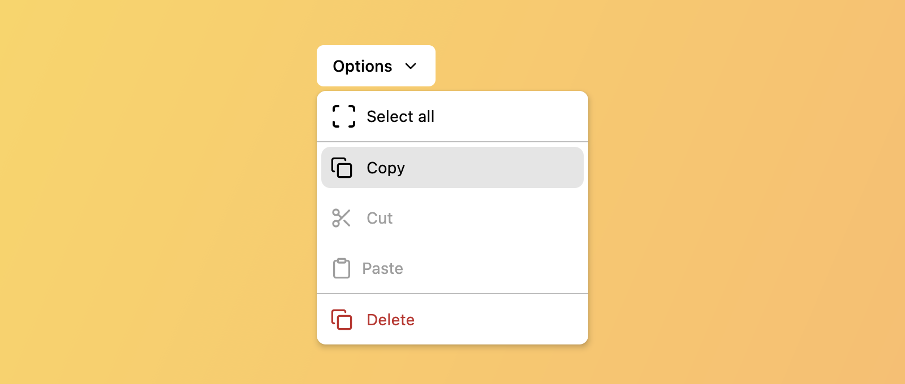
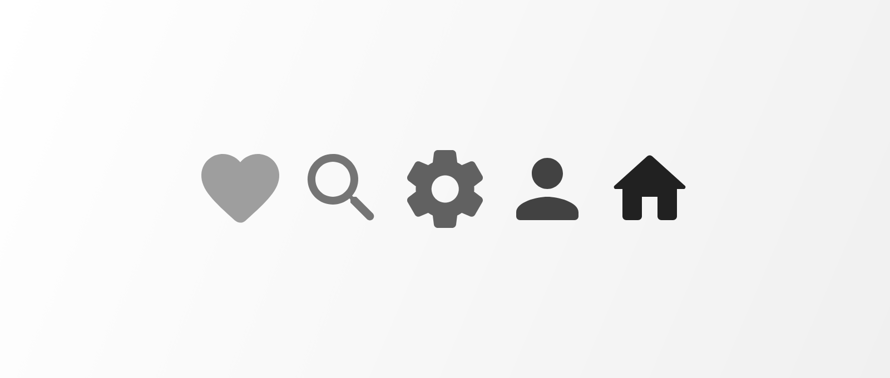
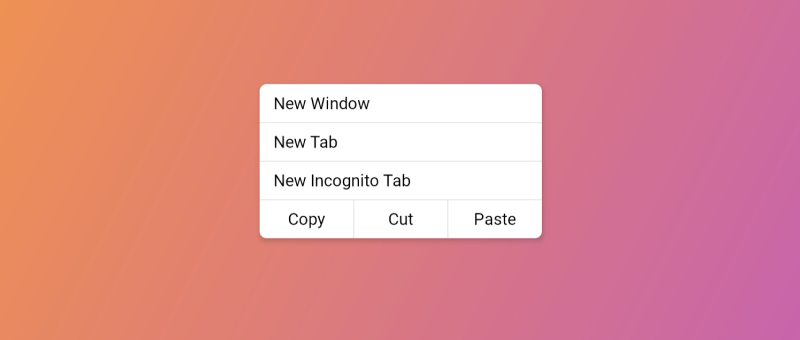

--- 
hide: -navigation -toc 
---

# Composables Core

Unstyled, fully accessible components for Jetpack Compose & Compose Multiplatform that you can customize to your heart's content.

Available for 🖥️ Desktop, 🌐 Web (Js/WASM), 🤖 Android, 🍎 iOS, and any other platform Compose can run on.

[💬 Ask questions on Discord](https://discord.com/channels/1264922125920374905/1264949180967686284)

    

        
        
Bottom Sheet

    

    

        
        
Bottom Sheet (Modal)

    

  

    
    
Dialog

  

  

    
    
Dropdown Menu

  

  

    
    
Icon

  

  

      
      
Scroll Area

  

  

      
      
Separators

  

## What developers say

  

    
  

  

    

      "@alexstyl just wanted to let you know that we just transition from M3 Modal Bottom Sheet to your composables core one and it fixed multiple issues 🎉"
    

    

      <h3>Matt Kula</h3>
      
Android @ Warner Music Group

    

  

  

    
  

  

    

"Ever since Composables Core was pointed out to me I use that one.
Simpler API, and it actually works. I like it a lot, after continuously having something broken with the (Material Compose) bottom sheets."  
    

    

      <h3>Jacob Ras</h3>
      
Android Engineer @ Albert Heijn

    

  

  

    
  

  

    

"This man did, what Googlers couldn't in 3 years of scrollbars "being on the roadmap" #androiddev"  
    

    

      <h3>Jacob Ras</h3>
      
EpicPandaForce @ SO

    

  

  

    
  

  

    

      "I wrote this library, so this will be biased 😁. I was tired of dealing with Material Compose sheets and dialogs issues, so I decided to write my own from scratch.
Plus, I needed high-quality, non-Material looking components for my Compose Multiplatform (desktop) apps, hence this library was born."
    

    

      <h3>Alex Styl</h3>
      
Author of Composables Core

    

  

